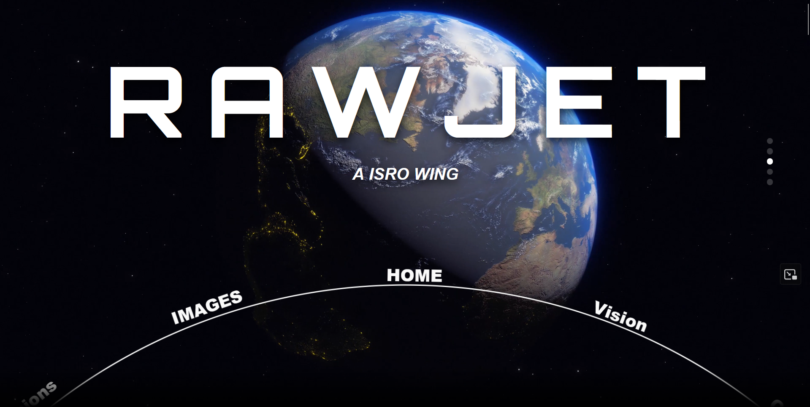
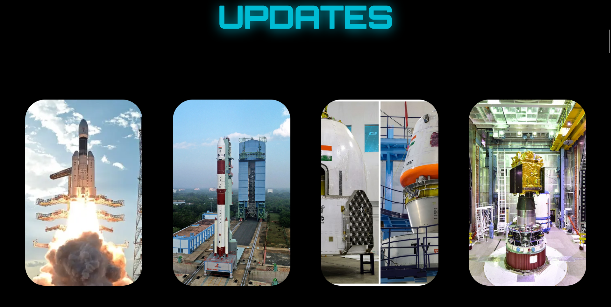
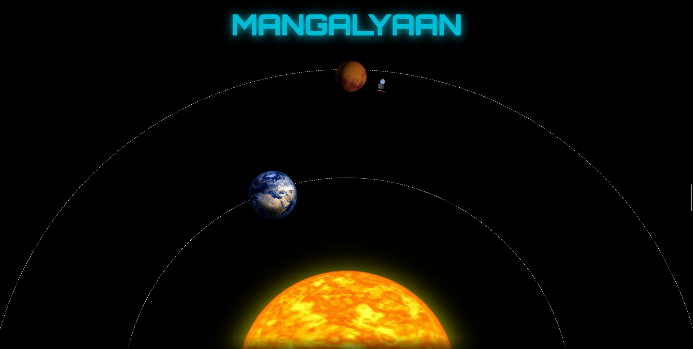
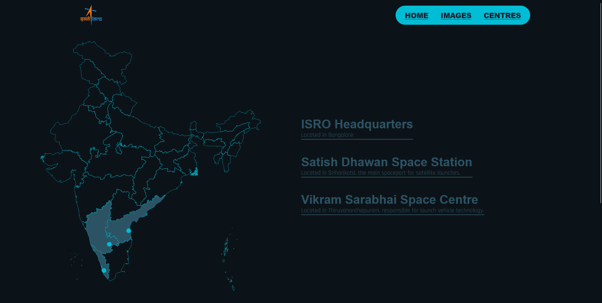

# 🚀 RawJet
An Interactive ISRO-Inspired Space Experience
<p align="center"> <b>Modern UI • Smooth Animations • Immersive Storytelling</b><br><br>      </p>
🌌 About the Project

RawJet is a space-themed interactive website inspired by ISRO, designed to deliver a cinematic and engaging user experience using modern frontend technologies.

It focuses on:

- Visual storytelling
- Smooth animations
- Clean and professional UI

# ✨ Features
- 🎬 Smooth GSAP Animations
- 🛰️ Mission Cards with Flip Effects
- 🌍 Interactive Space Elements
- 🎮 Built-in Quiz Module
- 🖼️ Image & Video Sections
- 📱 Fully Responsive Design
- 🛠️ Tech Stack
- HTML5   → Structure
- CSS3    → Styling & Layout
- JavaScript → Interactivity
- GSAP    → Animations

# 📁 Project Structure
RawJet/
│
├── index.html
├── missions.html
├── images.html
├── vision.html
├── updates.html
│
├── css/
├── js/
├── assets/
└── README.md

# ⚙️ Run Locally
```bash
git clone https://github.com/your-username/rawjet.git
cd rawjet
```

➡️ Open index.html in your browser

# 🚀 Future Improvements
- API integration (live ISRO data)
- Dark/Light mode 🌙
- Performance optimization ⚡
- Advanced interactions

# 🌍 Live Demo

🔗 https://isroraw.netlify.app/

# 📸 Preview






# 👨‍💻 Author

Tejwardeep Singh
B.Tech CSE | Full Stack Developer

# ⭐ Support

If you like this project:

⭐ Star this repo
🔁 Share it